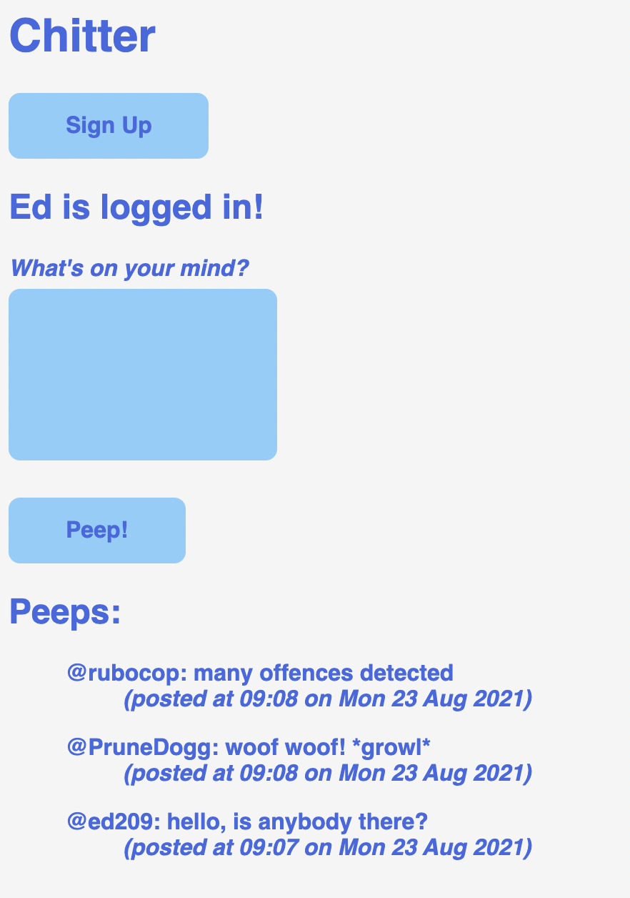

# Chitter Challenge



## Introduction

This is a simple twitter clone wep app that uses Ruby, Sinatra, and PostgreSQL. Password encryption is handled by BCrypt.

It is fully tested, with 100% coverage using RSpec and Capybara. I also managed to get a green tick with Travis CI.

Over the course of the weekend, I accomplished the 'straight up' [user stories](#user-stories), as well as all of the following required functionality:

```
* You don't have to be logged in to see the peeps.
* Makers sign up to chitter with their email, password, name and a username (e.g. samm@makersacademy.com, password123, Sam Morgan, sjmog).
* The username and email are unique.
* Peeps (posts to chitter) have the name of the maker and their user handle.
* Your README should indicate the technologies used, and give instructions on how to install and run the tests.
```

This was quite a tough project, but it provided good consolidation of what I had learned about SQL and databases from the previous week, and has given me lots of food for thought on what I still need to learn! I modelled the database and MVC on paper before I started coding, and kept notes for an upcoming blog on how the project developed over the weekend.

If I had more time I would look to implement:
* log in/log out functionality (per the 'Harder' [user stories](#user-stories)): at the moment, the app doesn't allow you to log back in as a previous account if you create a new account / restart the server.
* better CSS
* email notifications if a user is tagged in a peep (per the 'Advanced' user stories)
* bring in an Object Relational Mapper as the database interface (i.e. ActiveRecord)
* provide timezone synchronisation
* allow replies, likes, re-peeps
* confirm password box on sign up page
* password confirmation email
* account editing functionality - i.e. change password
* profile images, images in peeps?

Meanwhile, here's how to set up and use this app:

## Installation

```
git clone https://github.com/edpackard/chitter-challenge.git
cd chitter-challenge
gem install bundler
bundle install
```

## Database setup

1. Install and set up psql if required (Homebrew: `brew install postgresql`). 
2. Connect to `psql` via the Terminal
3. Create the production and test databases using the psql commands `CREATE DATABASE chitter;` and `CREATE DATABASE chitter_test;`
4. Connect to the production database using the pqsl command `\c chitter;`
5. Run the queries saved in the files `01_create_users_table.sql` and `02_create_peeps_table.sql`
6. Repeat step 5 after connecting to the test database: `\c chitter_test;`

## How to use this program

From the `chitter-challenge` directory run `rackup` from the Terminal.

If rackup starts correctly, you should see a port number (i.e. `port=9292`)

Open a browser windows and enter http://localhost:9292/

The Chitter homepage will list all peeps that have been made so far - on a fresh installation, there won't be any peeps.

To get started, click Sign Up. 

Enter your name, your preferred handle, password, and email address, following the instructions provided.

Click Submit when you are ready: if you have chosen a handle or email address that has already been used, you will get a notification, and the opportunity to try again or return to the homepage. On a fresh install, this won't be a problem. 

If your details are accepted, you will receive a welcome message - click Homepage to continue.

You will return to the Chitter homepage, which will indicate that you are logged in. A peep box will allow you to enter up to 140 characters of whatever is on your mind. When you are ready to peep, click Peep! You will see your peep appear in the Peeps feed immediately. If you peep again, you will see your latest peep move to the top of the Peeps feed.

If you want to peep with a different handle, you will have to sign up again - but bear in mind there is currently no functionality that will allow you to sign back in with your previous 'account'.

## How to run the tests

Run `rspec` from Terminal within the `chitter-challenge` directory. This will run all of the feature and unit tests. To run individual tests, put the file path after `rspec`, such as `rspec ./spec/unit/user_spec.rb`.

## User Stories

```
STRAIGHT UP

As a Maker
So that I can let people know what I am doing  
I want to post a message (peep) to chitter

As a maker
So that I can see what others are saying  
I want to see all peeps in reverse chronological order

As a Maker
So that I can better appreciate the context of a peep
I want to see the time at which it was made

As a Maker
So that I can post messages on Chitter as me
I want to sign up for Chitter

HARDER

As a Maker
So that only I can post messages on Chitter as me
I want to log in to Chitter

As a Maker
So that I can avoid others posting messages on Chitter as me
I want to log out of Chitter

ADVANCED

As a Maker
So that I can stay constantly tapped in to the shouty box of Chitter
I want to receive an email if I am tagged in a Peep
```